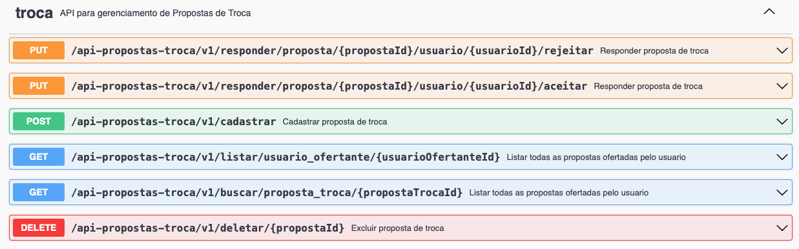
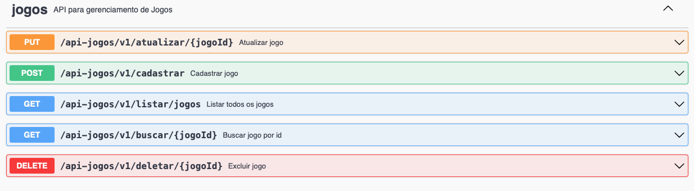
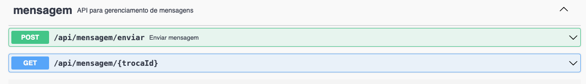
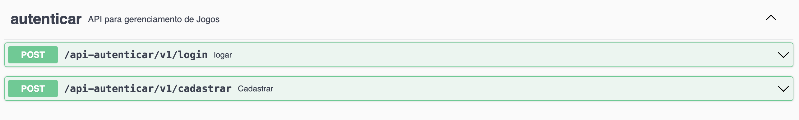
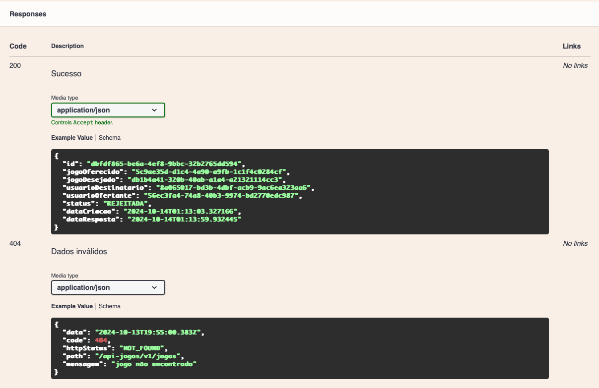

## Relatório Tecnico

Sistema desenvolvido em Spring boot com banco de dados H2. Como a ideia inicial era fazer o deploy da aplicação (não sendo possível fazer isso), foi disponibilizado a aplicacao do banco de dados H2 para testes na hora da correção. Todos os endpoins foram implementados e documentos no swagger com exemplos de retorno de sucesso e alguns exemplos de erro. Paginação foi feita no endpoint de jogos para retornar a lista de jogos. 

### Documentação das API`s

1. Clonar o projeto no github:  
2. Rodar o projeto localmente na máquina e acessar o link: http://localhost:8080/swagger-ui/index.html#/

Ao acessar o link vai encontrar a documentação dos endpoints das API`s. São elas:

- Api Usuarios

- Api Troca

- Api Jogos

- Api Mensagem

- Api Autenticacao

 

Cada endpoint terá exemplos de retorno de sucesso e de erro. Como por exemplo:

  

### Collections
Tem um arquivo collection_projeto_jogos para importar no insomnia e realizar os testes. 

### Sistema SEM Deploy Cloud

NÃO foi possível desenvolver essa parte. Posso desenvolver somente aos finais de semana no último infelizmente tive um pequeno contratempo de não ter energia na região de Jabaquara. 
